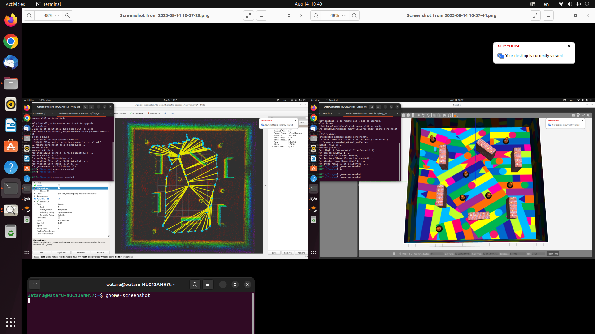
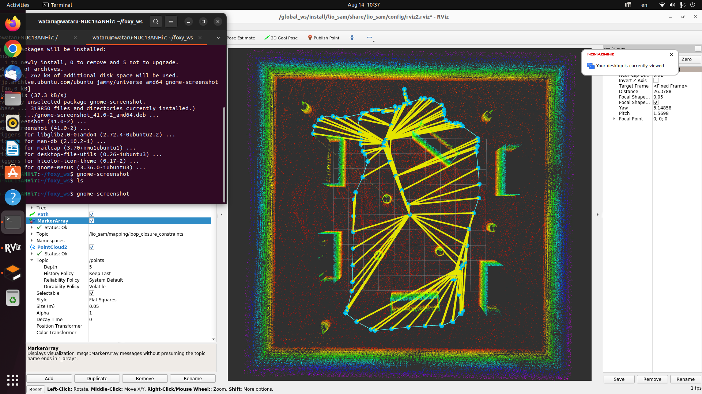
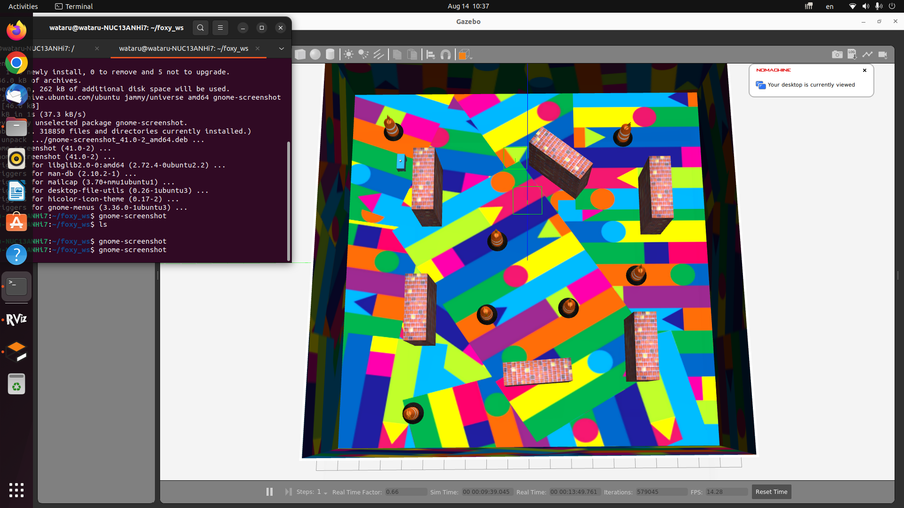
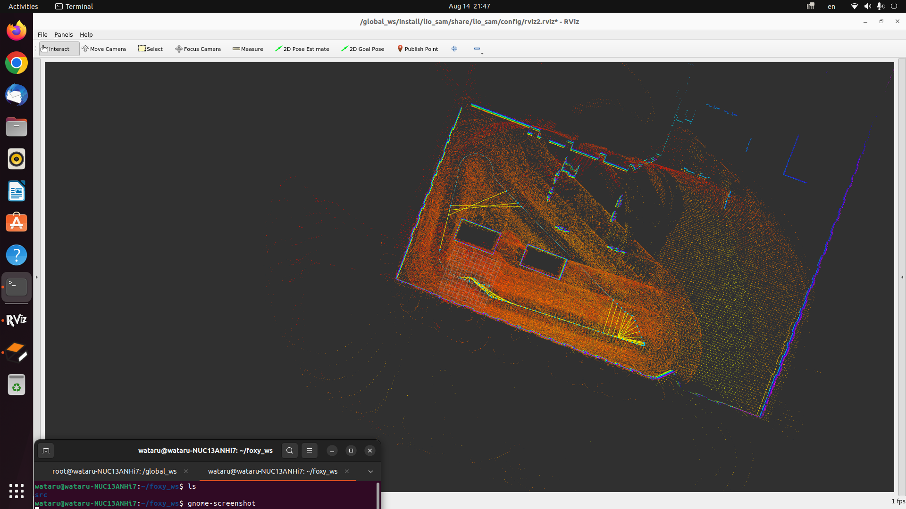
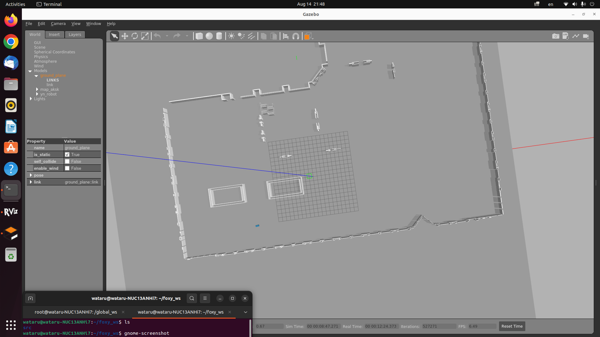

# ROS2 LIO-SAM Sample

This repository provides a sample implementation of the LIO-SAM (Lidar-Inertial Odometry Simultaneous Localization and Mapping) adapted for ROS2. It aims to help developers and researchers quickly get started with LIO-SAM in the ROS2 environment.

- **Pre-installed world**:




- **Created world with the path**:




## Features

- **ROS2 Adaptation**: Seamlessly integrates with ROS2 components.
- **Sample Data**: Contains sample rosbag data for testing.
- **Detailed Documentation**: Step-by-step guide to set up and run the package.

## Installation

1. Clone the repository into your ROS2 workspace.
   ```bash
   git clone https://github.com/Wataru-Oshima-Tokyo/ros2_lio_sam_sample.git
